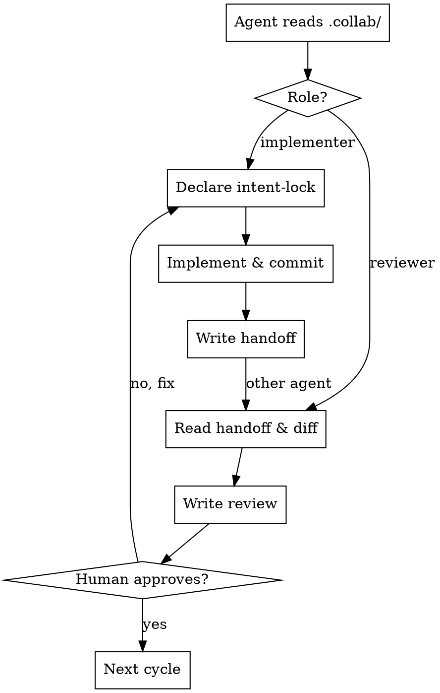

# Multi-Agent Collaboration Protocol

Two AI agents share one codebase. They coordinate through a `.collab/` directory — plain markdown files that any agent can read and write. The human approves every transition.

**Core principle:** The filesystem is the message bus. No sockets, no IPC. Turn-based — one agent works at a time.

## When to Use

- Two agents working on the same task with different roles
- You want cross-review between agents (not just self-review)
- You need shared context that survives across agent sessions

**Don't use when:** Single-agent task, or agents working on completely independent repos.

## Setup (< 2 minutes)

1. Copy `templates/collab/` to your project as `.collab/`
2. Edit `.collab/manifest.md` — set task, agent names, roles
3. Copy the right adapter to your project root:
   - `adapters/CLAUDE.md.template` → `CLAUDE.md`
   - `adapters/AGENTS.md.template` → `AGENTS.md`
   - `adapters/GEMINI.md.template` → `GEMINI.md`
4. Open two terminals. Start each agent. Tell each: "Read `.collab/manifest.md`, you are Agent A/B."

## Protocol



## .collab/ Directory

| File | Purpose |
|------|---------|
| `manifest.md` | Agent roster, roles, status, task description |
| `context.md` | Shared knowledge — codebase notes, decisions, open questions |
| `intent-lock.md` | File-level locks — declare before editing, release after commit |
| `log.md` | Append-only activity timeline |
| `handoffs/NNN-a-to-b.md` | What was done, what to review, what's next |
| `reviews/NNN-b-sha.md` | Review verdict, issues, strengths |

## Agent Lifecycle

```
1. Read .collab/manifest.md → check role & status
2. Read .collab/context.md → shared knowledge
3. Read .collab/intent-lock.md → check file locks
4. git pull → pick up other agent's commits

If implementer:
  5. Lock files in intent-lock.md → set status to "working"
  6. Implement → commit → release locks
  7. Write handoff → append to log
  8. Set status to "waiting-for-human"

If reviewer:
  5. Read latest handoff → set status to "reviewing"
  6. Run git diff <sha> → inspect changes
  7. Write review → append to log
  8. Set status to "waiting-for-human"

Human approves → sets agent status to "idle" → next cycle
```

## Manifest Format

```markdown
---
task: "Your task description"
created: 2026-03-20
status: active
---

## Agents
| id | agent | role | status |
|----|-------|------|--------|
| A  | claude-code | implementer | idle |
| B  | codex | reviewer | idle |

## Rules
- No agent edits a file locked by the other
- Human approves every review before next cycle
```

Status values: `idle`, `working`, `reviewing`, `waiting-for-human`

Agents update their own row only. Human sets agent to `idle` to signal approval.

## Intent Lock

Before editing any file, declare intent:

| file | agent | action | declared |
|------|-------|--------|----------|
| src/auth.ts | A | create | 2026-03-20T14:30:00+08:00 |

Actions: `create`, `modify`, `delete`. No read locks.

If file is locked by other agent → stop, write to Open Questions in `context.md`, set status `waiting-for-human`.

Release locks after committing. Stale locks (>1h, owner idle) flagged by other agent, cleared by human only.

## Handoff Format

```markdown
# Handoff NNN: Agent A → Agent B
- **commit:** abc1234
- **files changed:** src/auth.ts, src/middleware/auth.ts
- **status:** ready-for-review

## What I Did
[Summary]

## What To Review
[Focus areas, line references]

## What's Next
[Plan after review passes]
```

## Review Format

```markdown
# Review NNN: Agent B reviews commit abc1234
- **verdict:** approved | changes-requested | needs-discussion
- **handoff:** handoffs/NNN-a-to-b.md

## Issues
1. **[blocking]** file:line — description
2. **[nit]** file:line — suggestion

## Strengths
- [What was done well]
```

Review cycle: review → human approves → if `changes-requested`, implementer fixes → new handoff → re-review → repeat until `approved`.

## Context Sharing

`context.md` sections are append-only (except Open Questions, resolved by human):

- **Task Understanding** — what we're building
- **Codebase Notes** — discoveries about the code
- **Decisions Made** — timestamped, attributed
- **Open Questions** — pending human input

All timestamps: ISO 8601 (`2026-03-20T14:30:00+08:00`).

## Error Recovery

| Scenario | Fix |
|----------|-----|
| Agent crashes mid-cycle | Human resets status to `idle`, clears stale locks |
| Malformed .collab/ file | Human fixes manually |
| Commit SHA rebased away | Human creates new handoff with correct SHA |
| State irrecoverable | Delete all except manifest.md + context.md, restart |

## Two-Terminal Example

```
Terminal 1 (Claude Code)           Terminal 2 (Codex)
──────────────────────             ──────────────────
Human: "implement auth"            Human: "you are Agent B,
                                    read .collab/ and wait"

Agent A reads .collab/              Agent B reads .collab/
Agent A locks files                 Agent B: idle
Agent A implements, commits
Agent A writes handoff/001

                                    Human: "check for handoff"
                                    Agent B reads handoff/001
                                    Agent B reviews diff
                                    Agent B writes review/001

Human reads review
Human (T1): "fix review issues
in .collab/reviews/001"
Agent A fixes, commits
Agent A writes handoff/002
...cycle continues...
```

## Common Mistakes

| Mistake | Fix |
|---------|-----|
| Editing without declaring intent-lock | Always lock first |
| Forgetting to `git pull` before starting | Other agent's commits won't be visible |
| Not reading context.md | You'll miss decisions and repeat work |
| Skipping the human gate | Every transition needs human approval |
| Writing to other agent's manifest row | Only update your own status |
